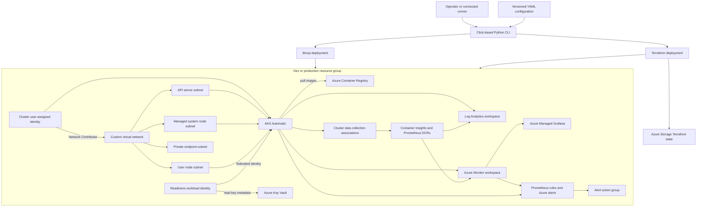
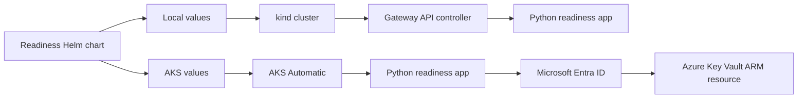
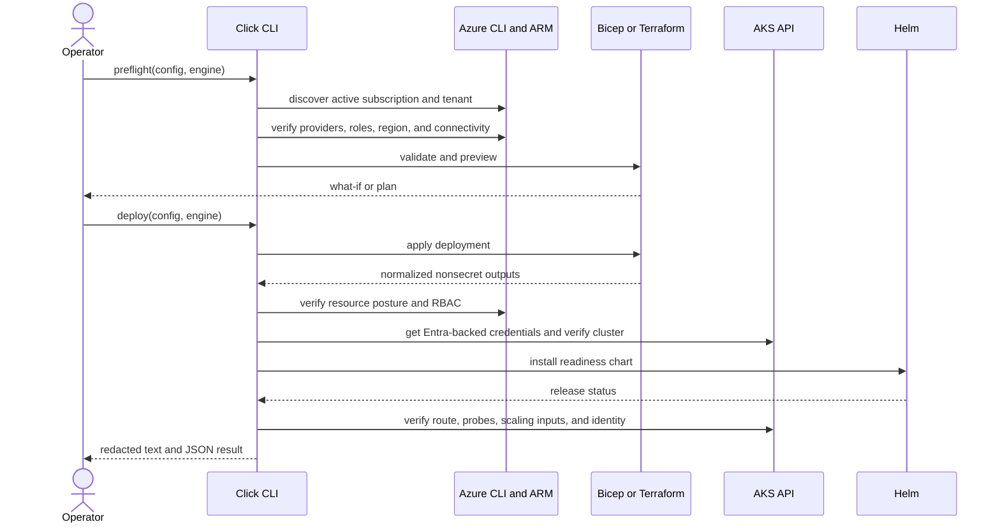

# AKS Automatic Infrastructure Foundation Design

- Status: Accepted
- Feature issue: [#3](https://github.com/toddysm/aiks/issues/3)
- Design branch: `design/3-aks-automatic-foundation`
- Design PR: [#4](https://github.com/toddysm/aiks/pull/4)
- Area: infrastructure
- Last updated: 2026-08-05

## Context

The repository needs a reproducible Azure Kubernetes Service (AKS) foundation before it can host model inference and agent examples. The foundation must let developers use a low-friction dev environment while preserving a production posture with private access, comprehensive observability, and least-privilege identity.

The solution supports two independently usable infrastructure-as-code (IaC) engines, Bicep and Terraform, behind one Python command-line interface. Both engines implement the same environment contract and converge on equivalent Azure resources, access, outputs, and security settings. A small readiness workload proves that later workloads can schedule, route traffic, use Microsoft Entra Workload ID, and run through the same Helm lifecycle on a local kind cluster and AKS.

AKS Automatic supplies the required Kubernetes network data plane through Azure CNI Overlay powered by Cilium. Istio is not a replacement for that data plane. A managed Istio add-on remains a future extension for workloads that need service-mesh mTLS, L7 traffic policy, or mesh telemetry.

## Goals and non-goals

### Goals

- Provision isolated dev and production AKS Automatic environments.
- Default to `westus3` while keeping the region configurable and validating current AKS Automatic availability before deployment.
- Implement equivalent Bicep and Terraform deployments.
- Expose one versioned YAML configuration contract for both engines.
- Provide a Click-based Python CLI for preflight, validation, preview, deployment, verification, and protected destruction.
- Create the Azure platform services needed by later inference and agent examples: networking, ACR, Key Vault, monitoring, identity, and RBAC.
- Verify the foundation with one Python readiness application and Helm chart on kind and AKS.
- Establish static CI, documentation, cost guidance, platform observability, and local operation reporting without product usage telemetry.

### Non-goals

- Deploy a model, inference server, agent, or multi-agent application.
- Request GPU quota or force creation of GPU capacity.
- Create private operator connectivity such as VPN, ExpressRoute, peering, jump hosts, or private CI runners.
- Deploy Azure resources from GitHub Actions.
- Implement multi-region disaster recovery.
- Provide production DNS names, certificates, or a general application ingress platform beyond readiness validation.
- Support Windows nodes, AKS Standard, or non-Azure cloud infrastructure.
- Enable Istio in the initial foundation.

## Requirements and scenarios

The requirements and acceptance criteria are maintained in [feature issue #3](https://github.com/toddysm/aiks/issues/3). The design supports these primary scenarios:

1. An operator selects a dev or production YAML file and an IaC engine.
2. The CLI validates local tools, Azure context, permissions, region support, resource providers, CIDRs, admin group, network access, and engine-specific prerequisites.
3. The operator reviews Bicep what-if or Terraform plan output.
4. The CLI deploys the foundation and emits normalized, nonsecret outputs.
5. The CLI verifies the Azure posture, connects to AKS, installs the readiness Helm chart, and validates scheduling, routing, probes, and Workload Identity.
6. A repeated deployment is idempotent.
7. Protected cleanup removes the workload and selected environment without deleting Terraform state accidentally.

For local validation, the CLI creates a named kind cluster, installs a Gateway API implementation with Helm, deploys the same readiness chart with local values, exercises install/verify/upgrade/rollback/uninstall, and deletes the kind cluster.

### Requirement traceability

| ID | Requirement | Design sections | Validation |
| --- | --- | --- | --- |
| R1 | Equivalent Bicep and Terraform foundation | Infrastructure and deployment; Parity contract | Static parity suite and Azure Resource Graph snapshots |
| R2 | Configurable dev and production posture | Environment posture; YAML configuration | Schema tests and post-deploy network assertions |
| R3 | AKS Automatic platform capabilities | AKS capability and parity contract | ARM profile assertions and Kubernetes capability checks |
| R4 | Click-based Python lifecycle CLI | CLI contract; Application and automation languages | Unit tests, `CliRunner` tests, and operator lifecycle |
| R5 | ACR, Key Vault, identity, and secret safety | ACR and image flow; Security and identity | Image-pull pod, Key Vault marker read, state/log secret scans |
| R6 | Production observability and lean dev | Monitoring resource graph; Observability | DCR/DCRA inspection, scrape target discovery, alert tests |
| R7 | One Helm chart on kind and AKS | Helm and routing | Install, route, health, upgrade, rollback, and uninstall tests |
| R8 | CPU-first and GPU-ready | Reliability, scale, performance, and cost | Rendered-manifest scheduling assertions and ARM NAP assertion |
| R9 | Protected and accurate cleanup | Terraform state bootstrap; Cleanup semantics | Confirmation tests and post-destroy residual report |
| R10 | Static CI and operator-run cloud validation | Test and CI strategy | Required GitHub checks and signed validation reports |

No tracking issue, work-item issue, implementation branch, or implementation file is created until this design is explicitly approved, changed to `Accepted`, and merged with all design PR checks green.

## Proposed architecture

### Azure environment topology

Each environment owns a separate resource group and VNet. Production also uses private endpoints and custom private DNS zones. Terraform state lives in a separate, Terraform-only state resource group so normal environment destruction cannot remove the active backend.



### Local and AKS workload topology



### Environment posture

| Concern | Dev default | Production default |
| --- | --- | --- |
| Resource isolation | Dedicated resource group and VNet | Dedicated resource group and VNet |
| AKS API | Public with required authorized CIDRs | Private, public FQDN disabled |
| ACR | Premium, deny-by-default public endpoint; node-subnet service endpoints plus configured operator CIDRs | Premium, public access disabled, private endpoint and DNS |
| Key Vault | RBAC, deny-by-default public endpoint; node-subnet service endpoints plus configured operator CIDRs | RBAC, purge protection, public access disabled, private endpoint and DNS |
| Container Insights | Enabled with configurable retention | Enabled |
| Managed Prometheus | Configurable, disabled by lean default | Enabled |
| Managed Grafana | Configurable, disabled by lean default | Enabled |
| Control-plane diagnostics | Reduced configurable categories | Audit and operational categories enabled |
| Alerts | Minimal cluster-health alerts; notification receivers optional | Cluster, readiness, capacity, and security baseline; at least one receiver required |
| Destroy protection | Typed environment confirmation | Typed confirmation plus explicit production override |

ACR uses Premium in both environments because private endpoints and registry network rules are Premium features. This is an explicit cost tradeoff for keeping the two environment shapes compatible.

## Control and data flows

### Infrastructure lifecycle



### Terraform state bootstrap

Terraform requires its backend before the main stack can initialize. A small Terraform bootstrap root initially uses ignored local state to create a dedicated state resource group, storage account, blob container, and operator data-plane RBAC. The CLI then reinitializes that bootstrap root with the Azure backend and migrates the bootstrap state. The main environment stack uses a separate key in the same container.

The backend is Terraform-specific operational support and is intentionally excluded from Bicep/Terraform environment parity. Bicep has no equivalent state service requirement. Normal `infra destroy` never deletes the backend.

Authentication uses the Azure CLI with `use_cli=true` and `use_azuread_auth=true`; account keys, SAS tokens, and storage connection strings are prohibited. The operator receives Storage Blob Data Contributor scoped to the state container. The storage account enforces TLS 1.2+, disables public blob access and shared-key authorization, enables blob versioning and soft delete, and uses configured operator IP/VNet rules or a pre-existing private access path. Bootstrap retries only known RBAC propagation failures.

State cleanup is a separate `aiks state destroy` operation. It refuses to run while any non-bootstrap state key, active lease, or deployed environment exists. The CLI pulls a mode-`0600`, ignored local recovery copy of bootstrap state, confirms the remote state is unlocked, deletes the state resource group out of band through Azure Resource Manager, verifies deletion, and writes a nonsecret cleanup receipt. It cannot use Terraform to destroy the storage account that contains its own active state. The operator chooses whether to retain the local recovery copy temporarily or securely delete it after verification.

### Workload Identity verification

The readiness application does not retrieve a secret. IaC asks Key Vault to generate a nonexportable key named `readiness-marker`; no key material is supplied by configuration or returned as an IaC output. The deployment creates a user-assigned managed identity and a federated credential with subject `system:serviceaccount:aiks-readiness:readiness`, audience `api://AzureADTokenExchange`, and the cluster OIDC issuer. The chart annotates the ServiceAccount with `azure.workload.identity/client-id` and labels the pod template with `azure.workload.identity/use: "true"`.

The marker key is created through the ARM child resource in both engines; Terraform uses a narrow AzAPI resource for this child instead of the AzureRM data-plane key resource. The operator therefore needs the ARM key-resource write permission but does not need Key Vault Crypto Officer. The readiness identity receives the Key Vault Reader data-plane role scoped to the vault, which permits reading key metadata but not cryptographic operations or secret values. On AKS, the application uses `DefaultAzureCredential` and the Azure Key Vault Keys client to retrieve the marker's public metadata through the vault endpoint. On kind, the identity check is explicitly reported as skipped while all other health and routing checks run.

This proves federated identity, Key Vault RBAC, private DNS, and private endpoint connectivity without creating secret values in configuration, Terraform state, Helm values, container images, or logs.

## Interfaces and configuration

### Repository layout

```text
infrastructure/aks-automatic/
|-- bicep/
|   |-- main.bicep
|   `-- modules/
|-- terraform/
|   |-- bootstrap/
|   |-- environment/
|   `-- modules/
|-- config/
|   |-- schema.json
|   |-- dev.example.yaml
|   `-- production.example.yaml
|-- charts/
|   `-- readiness/
|-- readiness-app/
|   |-- Dockerfile
|   `-- src/
`-- README.md
src/aiks/
|-- cli.py
|-- commands/
|-- config.py
|-- engines/
|-- process.py
|-- redaction.py
`-- results.py
tests/
|-- unit/
|-- integration/
`-- parity/
```

The root `pyproject.toml` defines the Python package and the `aiks` console entry point. The layout is intentionally extensible so later inference and agent workflows can add command groups without introducing another CLI.

### CLI contract

Click supplies nested command groups, options, environment-variable integration for ignored local testing, shell completion, and `CliRunner` testing.

```text
aiks infra preflight --config <file> --engine bicep|terraform
aiks infra validate  --config <file> --engine bicep|terraform
aiks infra plan      --config <file> --engine bicep|terraform
aiks infra deploy    --config <file> --engine bicep|terraform
aiks infra verify    --config <file>
aiks infra destroy   --config <file> --engine bicep|terraform

aiks state bootstrap --config <file>
aiks state status    --config <file>
aiks state destroy   --config <file>

aiks local create    --config <file>
aiks local delete    --config <file>

aiks workload install   --config <file> --target kind|aks
aiks workload verify    --config <file> --target kind|aks
aiks workload upgrade   --config <file> --target kind|aks
aiks workload rollback  --config <file> --target kind|aks
aiks workload uninstall --config <file> --target kind|aks
```

The CLI uses Python 3.12+, Click, Pydantic v2, PyYAML, Rich, standard logging, and pytest. It invokes `az`, `terraform`, `helm`, `kubectl`, `kind`, and `docker` with argument arrays through a single subprocess adapter and never uses `shell=True`.

Every command can emit a human-readable result and an optional JSON result file. Redaction operates before logging and covers known sensitive keys, bearer tokens, kubeconfig content, connection strings, Terraform sensitive values, and process output matching credential patterns.

### YAML configuration

The Pydantic model is the source of truth. CI generates JSON Schema and fails when the committed schema differs. Subscription and tenant IDs are not stored in the file; the CLI discovers them from the active Azure CLI context.

```yaml
apiVersion: aiks.io/v1alpha1
kind: AksAutomaticEnvironment
metadata:
  name: dev
spec:
  environment: dev
  location: westus3
  naming:
    prefix: aiks
  identity:
    adminGroupObjectId: 00000000-0000-0000-0000-000000000000
  network:
    vnetCidr: 10.20.0.0/16
    apiServerSubnetCidr: 10.20.0.0/28
    systemNodeSubnetCidr: 10.20.0.64/26
    userNodeSubnetCidr: 10.20.1.0/24
    privateEndpointSubnetCidr: 10.20.2.0/27
    podCidr: 10.244.0.0/16
    serviceCidr: 10.0.0.0/16
    dnsServiceIp: 10.0.0.10
    privateCluster: false
    authorizedIpRanges:
      - 203.0.113.10/32
    paasAllowedIpRanges:
      - 203.0.113.10/32
  observability:
    containerInsights: true
    managedPrometheus: false
    managedGrafana: false
    logRetentionDays: 30
    actionGroupResourceIds: []
  terraform:
    stateResourceGroup: rg-aiks-tfstate-dev
    stateStorageAccount: staikstfdev0001
    stateContainer: tfstate
  local:
    kindClusterName: aiks-readiness
  tags:
    application: aiks
    environment: dev
```

Schema rules enforce Azure naming limits, valid environment values, required authorized CIDRs for public API access, required dev PaaS operator CIDRs, private production defaults, valid and nonoverlapping CIDRs, DNS IP membership in the service CIDR, safe Terraform backend names, and required production observability. Production requires at least one existing action-group resource ID or one nonsecret receiver definition from which the environment action group is created.

No configuration field accepts a credential, secret value, storage key, SAS token, kubeconfig, or client secret.

### Normalized outputs

Both engines produce a JSON object with the same keys:

- environment and location
- resource group name and ID
- cluster name and ID
- public or private cluster FQDN as appropriate
- ACR name, ID, and login server
- Key Vault name, ID, and URI
- VNet and subnet IDs
- cluster and readiness identity resource IDs and client IDs
- Log Analytics, Azure Monitor workspace, and Grafana resource IDs/endpoints when enabled
- nonsecret readiness configuration

Kubeconfig, tokens, certificates, storage keys, and Key Vault values are never declared IaC outputs. The CLI obtains a short-lived Entra-backed kubeconfig with `az aks get-credentials` only when required. Because the AzureRM Automatic resource exposes computed kubeconfig-shaped fields, operator validation inspects a redacted `terraform show -json`; the entire backend is treated as sensitive even though no static Kubernetes credential is supplied by configuration.

### AKS capability and parity contract

| Capability | Bicep/ARM owner | Terraform owner | Required assertion |
| --- | --- | --- | --- |
| Automatic SKU | `sku.name: Automatic` | `azurerm_kubernetes_automatic_cluster` | SKU is Automatic |
| Hosted system nodes and NAP | `hostedSystemProfile` and Automatic defaults | `hosted_system` and Automatic defaults | user/system subnet IDs match; node provisioning mode is Auto |
| API server VNet integration | `apiServerAccessProfile.subnetId` | `api_server_access.subnet_id` | API endpoint uses delegated subnet |
| Production private API | private-cluster profile and custom DNS zone | `private_cluster` | no public FQDN; private FQDN resolves privately |
| Dev API restriction | authorized IP ranges | `api_server_access.authorized_ip_ranges` | no unrestricted source range |
| Azure CNI Overlay/Cilium | Automatic service profile | Automatic service profile | ARM network plugin/mode/data plane equal Azure/overlay/Cilium |
| OIDC and Workload Identity | Automatic service profile | Automatic service profile | issuer exists and workload identity is enabled |
| Azure RBAC/local accounts | Automatic service profile plus role assignments | Automatic service profile plus role assignments | Azure RBAC enabled; local accounts disabled; expected roles only |
| Policy safeguards | Automatic service profile | Automatic service profile | Azure Policy and deployment safeguards are enforced |
| Stable upgrades and node image updates | Automatic service profile | Automatic service profile | expected upgrade profiles remain enabled |
| Managed Gateway API CRDs | managed Gateway API installation profile | narrow AzAPI update if AzureRM lacks the profile | Gateway API CRDs are managed and established |
| Application-routing Gateway API | application-routing Istio profile | `web_app_routing_ingress.istio_enabled` | `approuting-istio` exists; service-mesh profile is absent |
| Container Insights | `addonProfiles.omsagent` plus DCR/DCRA | narrow AzAPI update plus DCR/DCRA | custom LAW association is active; no unexpected default LAW |
| Managed Prometheus | `azureMonitorProfile.metrics` plus DCR/DCRA | narrow AzAPI update plus DCR/DCRA | custom AMW association and scrape target are active |

For Terraform, AzureRM owns cluster creation and all fields exposed by the dedicated resource. One narrowly scoped `azapi_update_resource` owns only the missing managed Gateway API and monitoring profiles against stable API `2026-04-01`, after DCR destinations exist. Repeated plan/apply tests and post-deploy ARM assertions prove that AzureRM does not remove or reset those profiles. If this ownership cannot be made idempotent, implementation must stop and revise the design rather than move the whole cluster to AzAPI silently.

## Infrastructure and deployment

### Bicep

The Bicep entry point runs at subscription scope to create the environment resource group and deploy resource-group modules. The AKS resource uses the current stable `Microsoft.ContainerService/managedClusters@2026-04-01` API with `sku.name: Automatic`, a user-assigned identity, hosted system subnets, API server VNet integration, and the environment-specific private/public profile.

Modules separate naming, network, identity/RBAC, AKS, registry, vault/private endpoints, monitoring, and outputs. Resource API versions are pinned and reviewed explicitly. Bicep uses deterministic role-assignment GUIDs and declares dependencies where identity propagation or subnet permissions require ordering.

### Terraform

Terraform constrains AzureRM to `>= 5.0.1, < 6.0.0` and uses `azurerm_kubernetes_automatic_cluster` for the cluster. AzureRM resources manage the resource group, network, identities, RBAC, ACR, Key Vault, private endpoints/DNS, monitoring, alerts, and Grafana.

One narrowly scoped `azapi_update_resource` owns only Automatic properties not exposed by AzureRM: managed Gateway API installation and the Container Insights/managed Prometheus cluster profiles. It targets stable API `2026-04-01`, runs after custom monitoring destinations exist, and is covered by repeated-plan assertions. AzAPI is not used for resources supported by AzureRM, except the server-generated marker-key ARM child noted above. Parity tests inspect resulting ARM properties rather than provider implementation details.

Provider lock files are committed. CI runs `terraform fmt`, `terraform init -backend=false`, `terraform validate`, TFLint, and a security scanner.

### Parity contract

A committed parity specification maps each semantic input, output, resource, role assignment, and security assertion to both engines. Offline tests compare:

- YAML-to-Bicep parameter and YAML-to-Terraform variable mappings
- normalized output schemas
- generated resource inventory and required role definitions
- network and endpoint settings
- production/dev policy assertions

An operator-run integration verifier queries Azure Resource Graph after deployment and emits a normalized snapshot. Snapshots from Bicep and Terraform must satisfy the same assertions; names may differ only where Azure requires globally unique values.

Terraform backend resources are the only engine-specific Azure resources excluded from environment parity, because they implement Terraform state rather than the AKS foundation.

### Network and DNS

Each environment VNet contains:

- an API server subnet delegated to `Microsoft.ContainerService/managedClusters`, minimum `/28`
- a managed system node subnet, default `/26`
- a user node subnet, default `/24`
- a private endpoint subnet, default `/27`

The cluster user-assigned identity receives Network Contributor on the VNet before cluster creation. Production creates `private.<region>.azmk8s.io` or an approved subzone and links it to the VNet. The cluster identity receives Private DNS Zone Contributor on that zone before cluster creation. The zone choice is replacement-sensitive and cannot be changed in place. ACR and Key Vault use `privatelink.azurecr.io` and `privatelink.vaultcore.azure.net` private DNS zones and private endpoints in production.

The connected production operator network must resolve the AKS, ACR, and Key Vault FQDNs through conditional forwarding, Azure Private DNS Resolver, or an existing equivalent path. Preflight records the prerequisite before deployment; post-deploy verification requires those FQDNs to resolve to the expected private addresses and TCP connectivity to succeed.

Dev requires at least one authorized API CIDR and one PaaS operator CIDR. The user and managed-system node subnets enable `Microsoft.ContainerRegistry` and `Microsoft.KeyVault` service endpoints. ACR and Key Vault use `defaultAction=Deny`, subnet network rules for both node subnets, and configured public operator CIDRs. The schema rejects an unrestricted dev posture. Post-deploy verification schedules a pod to pull from ACR and read Key Vault metadata, and confirms a request from a nonallowed source is denied when an external negative-test path is available.

The CLI validates CIDR overlap within the environment. Operators are responsible for avoiding overlap with networks used by the connected production operator path; preflight accepts optional known-connected CIDRs and warns when they overlap.

AKS may add or update service-owned subnet delegations and policies. Terraform follows the official Automatic-resource lifecycle guidance for those properties. Bicep models subnets as child resources and preserves service-owned properties rather than issuing a later full-VNet replacement that omits them. A repeated-deployment assertion verifies that delegations, service endpoints, and private-endpoint policies do not churn.

### ACR and image flow

The readiness image is built locally. For kind, the CLI loads the image directly into the named kind cluster. For AKS, it pushes the image to ACR and the chart references the immutable digest.

ACR explicitly pins `LegacyRegistryPermissions`; the generated kubelet identity therefore receives AcrPull on the registry. After AKS creation, IaC reads the generated kubelet identity from ARM. A narrow AzAPI data read is preferred over the AzureRM data source so Kubernetes credential-shaped fields do not enter state unnecessarily. ACR admin credentials remain disabled. A future move to ABAC repository permissions requires a design change and repository-scoped pull role.

### Helm and routing

The readiness chart includes Namespace, ServiceAccount, Deployment, Service, Gateway, HTTPRoute, optional PodDisruptionBudget, a conditional Azure Monitor `ServiceMonitor`, and configurable autoscaling resources. The `azmonitoring.coreos.com/v1` ServiceMonitor renders only when managed Prometheus is enabled; kind and lean-dev values disable it because that CRD is absent. The chart uses values schemas, restricted security contexts, resource requests/limits, topology spread constraints, and no embedded environment values.

The AKS target explicitly enables managed Gateway API CRDs and the application-routing Gateway API implementation. The chart sets `gatewayClassName: approuting-istio`; this deploys a sidecarless Istio ingress control plane but does not enable the `serviceMeshProfile` add-on or inject workload sidecars. The `Gateway` creates an HTTP listener and the `HTTPRoute` attaches through a named parent reference. Production applies the allowed Azure Load Balancer internal annotation through the supported per-Gateway customization path. Dev uses an external load balancer.

Verification requires the GatewayClass `Accepted` condition, Gateway `Accepted` and `Programmed` conditions, HTTPRoute `Accepted` and `ResolvedRefs` conditions, and an HTTP 200 response through the assigned address. Production additionally asserts that the generated LoadBalancer service has a private RFC1918 address and that no public frontend is attached; the request originates from the connected operator network.

For kind, the CLI installs Gateway API CRDs and a pinned supported Gateway controller through its upstream Helm chart, then installs the readiness chart with local values. The application chart remains the same for both targets.

## Application and automation languages

The CLI and readiness service use Python 3.12+. The readiness service uses FastAPI, Uvicorn, Azure Identity, and the Azure Key Vault Keys client. It exposes:

- `/livez` for process liveness
- `/readyz` for application readiness
- `/identityz` for AKS identity verification or an explicit local skip result
- `/metrics` for readiness and request metrics

Shell scripts are avoided. If a tool requires one, it must declare Bash or zsh explicitly, pass ShellCheck, and contain no credentials.

## Security and identity

### Identity hierarchy

The design uses the highest-ranked viable mechanism, managed identity, everywhere:

- cluster user-assigned identity for custom networking and private DNS operations
- AKS-managed kubelet identity for ACR pulls
- readiness user-assigned identity plus federated credential for the Kubernetes service account
- Azure CLI user identity for operator deployment and Terraform backend access

Kubernetes Secrets backed by Key Vault are not required by this feature because the readiness app consumes no secret. Runtime secret retrieval is also not required. Environment variables are limited to ignored local test settings and do not carry Azure credentials.

### Human access

The configured Entra platform-admin group receives Azure Kubernetes Service Cluster User plus Azure Kubernetes Service RBAC Cluster Admin at cluster scope. Cluster Admin is required because the Helm lifecycle owns a cluster-scoped Namespace in addition to namespaced workloads, ServiceAccounts, Gateway, HTTPRoute, and release resources; the narrower AKS RBAC Admin role cannot create or delete namespaces. The exact two assignments are parity and acceptance assertions. Azure RBAC remains enabled, local AKS accounts remain disabled, and this broad role is limited to the explicitly configured platform-administrator group. Future application groups use namespace-scoped roles. The deployer receives no durable cluster role unless it belongs to the configured group.

Future workload access should use namespace-scoped roles instead of cluster admin. The broad role in this feature is explicitly the platform administrator role.

### Secret controls

- ACR admin credentials are disabled.
- Key Vault uses Azure RBAC and contains a service-generated, nonexportable readiness key but no readiness secret.
- Terraform state is sensitive. It contains resource metadata and may contain provider-computed kubeconfig-shaped fields, but no static credential is supplied by configuration or exposed as a declared output.
- Kubeconfig is not persisted in repository paths or emitted as an output.
- CLI process invocations avoid command-line secrets and redact captured output.
- Tests scan source, YAML, Terraform, Bicep, Helm values, images, logs, and fixtures for credentials.

## Observability

### Monitoring resource graph

Production creates a custom Log Analytics workspace, Azure Monitor workspace, Managed Grafana instance with system identity, Container Insights DCR/DCRA, managed Prometheus DCR/DCRA, diagnostic settings, Prometheus rule groups, Azure Monitor alerts, and an action group or links to configured existing action groups. Grafana links to the Azure Monitor workspace, and its identity receives Monitoring Reader scoped to that workspace. The deployment detects and rejects unexpected service-created default workspaces instead of leaving duplicate ingestion paths.

The chart's `ServiceMonitor` selects the readiness Service and exposes `/metrics` to the managed Prometheus collector. Verification queries target discovery and confirms recent readiness samples in the configured workspace.

Production enables:

- Container Insights to Log Analytics
- Azure Monitor managed Prometheus
- Azure Managed Grafana linked to the monitor workspace
- AKS control-plane diagnostics, including audit and operational categories
- baseline alerts for cluster availability, failed nodes/pods, readiness, capacity pressure, and diagnostic pipeline health

Dev enables Container Insights by default and keeps Prometheus, Grafana, alert breadth, and retention configurable to control cost.

The minimum production signal contract is:

| Signal | Condition | Window | Severity |
| --- | --- | --- | --- |
| AKS resource health | Activity Log Resource Health event reports unavailable or degraded | N/A (event-driven) | 1 |
| Readiness metric | `aiks_readiness_info{status="ready"}` absent or not `1` | 5 minutes | 1 |
| Failed pods | failed-phase pod count greater than zero | 5 minutes | 2 |
| Node readiness | Ready condition false | 5 minutes | 1 |
| CPU or memory pressure | greater than 85% requested/capacity | 15 minutes | 2 |
| Monitoring pipeline | no expected ingestion heartbeat | 15 minutes | 2 |

Production routes these alerts to at least one configured action group. Dev creates the alert rules only when enabled and may omit notification receivers. Required Grafana panels show node/pod readiness, CPU/memory request and use, NAP provisioning behavior, readiness latency and failures, HTTP request rate/error/latency, and alert state. Metrics carry environment, cluster, namespace, workload, and target dimensions. CLI JSON results include a locally generated correlation ID that is repeated in logs but not sent to Azure as product telemetry.

Operator validation checks every metric query and rule-group health, then deliberately makes the readiness endpoint fail in the isolated validation workload. The readiness alert must fire, notify the configured production action group, and resolve after recovery. Resource Health validation confirms the Activity Log alert definition and action-group binding without manufacturing a platform outage.

The CLI logs operation, phase, duration, result, nonsecret resource context, and actionable remediation. It emits an optional JSON summary for automation. It sends no usage telemetry.

The readiness app exposes Prometheus-compatible metrics but does not add distributed tracing in this feature.

## Reliability, scale, performance, and cost

AKS Automatic provides managed system nodes, node auto-provisioning, automatic repair/upgrades, uptime SLA, and qualifying pod-readiness SLA. The readiness workload is CPU-only, defines explicit requests/limits, and has no CPU-specific node selector, architecture constraint, or taint that would interfere with later GPU workloads. No GPU node is created until a later workload requests a supported GPU resource and quota exists.

Acceptance timing starts when the selected engine begins its apply operation and ends when the readiness route, identity, and monitoring checks pass. It must complete within 30 minutes, excluding documented Azure capacity incidents or operator private-network outages. Pod readiness timing starts when the Deployment is created and ends when all desired replicas report Ready; a qualifying pod uses a supported Linux image, requests resources available in the selected region/quota, passes deployment safeguards, and has no image or configuration error. Qualifying readiness pods must become Ready within five minutes. The CLI records timestamps and evidence for failures.

Primary cost drivers are:

- AKS workload nodes created by NAP
- Premium ACR required for private endpoints/network restrictions
- Log Analytics ingestion and retention
- Azure Managed Grafana
- private endpoints and networking data processing
- Azure Monitor managed Prometheus ingestion

The CLI documents Azure pricing-calculator inputs and can emit a resource inventory for estimation. It does not claim an exact price because node choices are workload-driven and prices vary by region and agreement.

## Test and CI strategy

### Pull-request CI

- Python: Ruff, mypy, pytest, coverage, Bandit, dependency audit, and Click `CliRunner` tests
- configuration: Pydantic/JSON Schema drift check plus valid and invalid YAML fixtures
- Bicep: build, lint, template inspection, and security/policy checks
- Terraform: format, init without backend, validate, TFLint, provider lock verification, and security/policy checks
- Helm: lint, template, values schema, kubeconform, and policy checks
- parity: semantic input/output/resource/RBAC/security assertions for both engines
- repository: Markdown links/lint, actionlint, JSON/YAML validation, secret scanning, and CodeQL
- local integration: ephemeral kind lifecycle for install, route, health, upgrade, rollback, and uninstall

No PR job authenticates to Azure or deploys cloud resources.

### Operator-run Azure validation

Before implementation completion, a connected operator runs one complete dev lifecycle and one complete private production-shaped lifecycle with each engine, using sequential isolated environments to avoid cross-engine ownership. If any lifecycle cannot be executed, the corresponding acceptance criteria remain unmet and the implementation PR cannot merge without an explicit user-approved scope change.

Verification captures ARM state, private DNS answers, TCP reachability, Kubernetes conditions, ACR image pull, Workload Identity, Prometheus target/sample discovery, DCR/DCRA associations, Grafana linkage, alert rules, redacted Terraform state shape, repeated plan/what-if output, Helm lifecycle, readiness timing, and post-destroy residuals.

### Cleanup semantics

Environment cleanup removes Helm resources and the environment resource group. Production Key Vault purge protection means the vault remains soft-deleted for its retention period and its globally unique name is not immediately reusable. This is an expected retained artifact, not a cleanup failure. IaC disables futile purge-on-destroy behavior; the CLI reports the soft-deleted vault name, recovery window, and recovery/purge permissions without attempting to bypass purge protection. Names include a deterministic subscription/environment hash so an authorized recovery can reuse the same name after accidental deletion, while a deliberately new deployment can select a new naming seed.

Cleanup acceptance distinguishes deleted live resources from expected soft-deleted Key Vault retention and independently managed Terraform backend state. The result report must enumerate every residual artifact and why it remains.

## Alternatives considered

### Typer instead of Click

Rejected by user decision. Click supplies the required command grouping, option handling, shell completion, and test runner without requiring type-hint-driven command generation.

### AKS managed network

Rejected because production requires explicit private connectivity, custom subnets, private endpoints, and DNS integration. A custom VNet makes these Day-0 boundaries visible and reproducible.

### AzAPI-only Terraform cluster

Rejected because AzureRM 5.0.1 now has a dedicated `azurerm_kubernetes_automatic_cluster`. Native AzureRM is preferred. AzAPI remains a narrow compatibility tool only for required ARM properties not exposed by the dedicated resource.

### AKS Standard

Rejected because the feature specifically targets Automatic's managed system nodes, node auto-provisioning, safeguards, and operational defaults.

### Istio instead of Cilium

Rejected because Istio does not provide pod IP allocation or replace the Kubernetes network data plane. Cilium is required by the AKS Automatic network profile. Istio adds L7 mesh behavior and can be enabled later in addition to Cilium when a workload justifies its latency, compute, and operational cost.

### Local Terraform state

Rejected for shared and production use. Azure Storage with Entra authentication provides locking, durability, and access control without account keys.

### Azure SDK-driven provisioning in the CLI

Rejected because it would create a third infrastructure implementation and weaken Bicep/Terraform parity. The CLI orchestrates declarative engines and uses Azure APIs only for discovery and verification.

## Risks and mitigations

| Risk | Impact | Mitigation |
| --- | --- | --- |
| AKS Automatic and providers evolve quickly | Provider fields or API versions drift | Pin versions, use stable APIs, validate region/features in preflight, add contract tests, and isolate narrow AzAPI use |
| Private production API is unreachable | Deployment succeeds but Helm verification cannot run | Require connected operator DNS/network path and fail preflight before deployment when verification is requested |
| Identity propagation delays role use | Cluster or workload verification fails transiently | Declare IaC dependencies and use bounded retries only for known propagation errors |
| ACR kubelet identity is not exposed by native Terraform output | AcrPull assignment cannot be created natively | Read the identity profile through a nonsecret AzAPI data lookup after cluster creation |
| Terraform backend bootstrap is interrupted | State storage exists with incomplete local migration | Use deterministic names, idempotent bootstrap, ignored local state, migration verification, and explicit recovery instructions |
| Bicep and Terraform diverge | Environments have different security or behavior | Maintain parity spec, normalized outputs, offline assertions, and operator-run Azure snapshots |
| Gateway API behavior differs between kind and AKS | Same chart routes differently | Pin local controller, verify GatewayClass capabilities, keep target values explicit, and test rendered resources |
| Monitoring creates unexpected cost | Dev environments become expensive | Lean dev defaults, configurable retention/components, resource inventory, and cost guidance |
| Regional capacity delays provisioning | Thirty-minute target is missed | Preflight region support/quota, report capacity errors clearly, and allow a configurable region |
| Destroy removes the wrong environment | Data loss and outage | Typed environment confirmation, explicit production override, active subscription/resource summary, and backend exclusion |
| Purge-protected Key Vault remains soft-deleted | Name cannot be reused immediately | Treat retention as expected, report it explicitly, support recovery, and use a configurable deterministic naming seed |
| AzureRM and AzAPI profile ownership conflict | Repeated plans reset monitoring or Gateway API | Limit AzAPI to named missing properties, order updates, assert ARM state, and require a clean repeated plan |

## Delivery plan

1. Establish configuration models, JSON Schema, Click CLI skeleton, process boundary, redaction, and unit tests.
2. Implement Bicep modules and normalized outputs.
3. Implement Terraform backend bootstrap, environment modules, and normalized outputs.
4. Implement parity specification and static CI for both engines.
5. Implement readiness service, image flow, Helm chart, and kind lifecycle.
6. Implement Azure verification, Workload Identity test, protected cleanup, and result summaries.
7. Add operator documentation, cost guidance, troubleshooting, and end-to-end validation evidence.

Work-item issues created after design acceptance will refine this ordering into independently verifiable deliverables.

## Decisions and open questions

- Decision: use Click for the Python CLI.
- Decision: use Azure CNI Overlay/Cilium as the AKS network data plane and defer Istio until a workload requires mesh features.
- Decision: use native `azurerm_kubernetes_automatic_cluster` with AzureRM 5.0.1 or later; limit AzAPI to unsupported properties and nonsecret reads.
- Decision: explicitly enable managed Gateway API CRDs and `approuting-istio`; this sidecarless ingress implementation is in scope while the Istio service-mesh add-on remains disabled.
- Decision: use service endpoints and deny-by-default network rules for restricted dev ACR/Key Vault access; use private endpoints in production.
- Decision: use Azure Kubernetes Service RBAC Cluster Admin for the platform-admin group because the Helm lifecycle owns a Namespace; limit the role to that explicitly configured group and keep local accounts disabled.
- Decision: use separate resource groups and VNets for dev and production.
- Decision: use a private production cluster and require an existing connected operator path.
- Decision: use restricted public access for dev rather than an unrestricted API or PaaS endpoint.
- Decision: use user-assigned managed identities and Workload Identity; create no static Azure credential.
- Decision: use Azure Storage with Entra authentication for Terraform state.
- Decision: treat Terraform backend resources as engine-specific operational support outside environment parity.
- Decision: use a CLI-managed kind cluster and one readiness Helm chart for local and AKS validation.
- Decision: keep Azure deployment out of GitHub PR CI.
- Open: none.

## References

- [Introduction to AKS Automatic](https://learn.microsoft.com/azure/aks/intro-aks-automatic)
- [Create a private AKS Automatic cluster in a custom VNet](https://learn.microsoft.com/azure/aks/automatic/quick-automatic-private-custom-network)
- [Azure CNI powered by Cilium](https://learn.microsoft.com/azure/aks/azure-cni-powered-by-cilium)
- [Microsoft Entra Workload ID on AKS](https://learn.microsoft.com/azure/aks/workload-identity-overview)
- [AzureRM Automatic cluster resource](https://registry.terraform.io/providers/hashicorp/azurerm/latest/docs/resources/kubernetes_automatic_cluster)